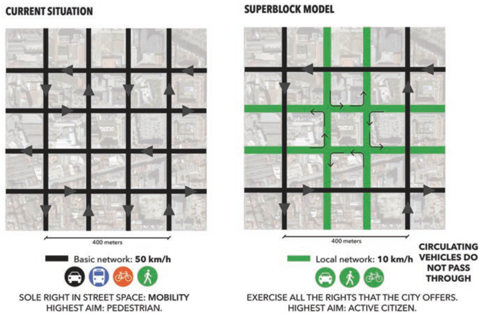

# Agent-Based Modeling and Social System Simulation 2020. *A Barcelona Paradox*

> * Group Name: **SOS** (**S**ub**O**ptimal **S**olutions)
> * Group participants names: Argota Sanchez-Vaquerizo, Javier & Schwarzenbach, Daniel 
> * Project Title: Suboptimal Traffic Efficiency in Changing Habitats (SOTECH). *A Barcelona Paradox*

## Abstract
----------

## General Introduction

*(States your motivation clearly: why is it important / interesting to solve this problem?)
(Add real-world examples, if any)
(Put the problem into a historical context, from what does it originate? Are there already some proposed solutions?)*

### Towards a systematic understanding of urban spaces
Utilitarian traffic optimization goals has dominated transport engineering since it appears as a proper discipline with the rise of private motorized vehicles. It has shaped our industrial and post-industrial cities that we inhabit. Modern Urbanism, as we understand it nowadays, sinks its roots at into a revolutionary scientific and technical approach towards the understanding of urban environment conditions and the efficient distribution of people, good, and resources around the city (***see Cerda***). Even Modernist urban planners and architects in the early 1900's endorsed a radical mechanistic understanding of cities (***see Chart of Athens/CIAM***). However, this scientific and positivist approach of traffic engineers contradicts the common practice in urban and city planning. Spatial planning, urban design, and collateral disciplines in the same realm, are affected by a combination of experimental data, domain expertise, ideology, and policy and political constraints in a non-straightforward decision making process in which opposed agendas promoted by different stakeholders are leverage to reach ideally a feasible compromise. In the best case scenario, many urban interventions are based on some domain expertise-backed intuition with the hope of eventually getting people's approval and political adoption.

The understanding of complex effects of spatial planning decisions in cities is still very limited and scarcely applied to common practice. In this context, the assessment of urban interventions in cities frequently lacks evidence support. It undermines any possibility of evaluation of results, iterative process of potential improvement, and proper informed-decision making for technical experts, decision makers, and citizens in general. The later is particularly relevant as this lack of comprehensive information on the effects of planning decisions in cities dismisses the quality of participatory processes, by masking accessible knowledge to people, and making easier to manipulate these processes (***cite on shielding participatory processes as an excuse to self justifying already taken decisions and passing the responsibility to citizens. El Diario and a new one***).

### Barcelona's Superblocks
This knowledge and methodological gap does not hinder experimentation and innovation in the most complex human creation (citation here) as cities are. In recent years, there is a clear trend on reducing the space reserved for private motor vehicles in cities to improve air quality and environmental conditions, to foster alternative transportation modes, or to reduce the use of fossil fuels (***citations would be good here*** and as well ***examples of these interventions***). Among these current trends on urban planning, Barcelona's Superblocks has been one of the most published in the last years (***some refs from The Guardian, NYT, etc***). The Superblock's plan aims to reduce the space for the motor private vehicles in the street network to improve living conditions of city inhabitants by reducing noise and air-pollution and giving room to other transportation modes. It is being accomplished by creating large blocks of 3-by-3 of current square city blocks and leaving inside only loop-like residential streets. It means that 1 out of 3 streets of the city are left for driving through traffic. The well-known and a-thousands-of-times depicted idiosyncrasy of the so regular Barcelona grid comes together with a long tradition on public engagement on urban planning and experimentation in the city set an ideal scenario for testing out the unknown effect of these and other modifications in urban networks.

	
	Barcelona Superblocks schema (Rueda, 2018).

### The Braess Paradox
Among one of the most interesting and intriguing effects that defies the common understanding for operating in the urban infrastructures is the so-called Braess Paradox. It explains the counter-intuitive observation that adding more links to a given network, such as a transportation one, can slow down overall traffic flow. It is caused by the selfishly behavior of the entities that are moving in the network when trying to optimize individually their travel time (or cost). It causes to get away from the system optimum. that contrary to the real behavior, requires some level of collaboration between the agents(***cite Braess original paper***).

## Fundamental Questions

*(At the end of the project you want to find the answer to these questions)
(Formulate a few, clear questions. Articulate them in sub-questions, from the more general to the more specific. )*

* Are there too many streets for cars that actually are causing bigger congestion?

* If adding new roadways links leads to increased congestion, according to Braess, may removing streets for vehicles cause improvement of traffic, as expected by the Superblocks plan?

* Can we apply the counterintuitive Braess’ Paradox effects for our own benefit in the planning of cities?

## Research Methods

*(Cellular Automata, Agent-Based Model, Continuous Modeling...) (If you are not sure here: 1. Consult your colleagues, 2. ask the teachers, 3. remember that you can change it afterwards)*

For modeling and simulating an urban environment to test these changes a microscopic agent-based simulation approach is followed. With this in mind, a common framework applied to transportation modeling in cities called SUMO. This software can simulate virtually any element moving around a city or region as individual agents according to different rules. (***citation SUMO guide or similar***).

Additionally, this framework allows to run mesoscopic simulations based on a queueing: it is, instead of simulating every agent behavior independently as in an agent-based approach, every street segment is modeled as a queue of vehicles. (***citation of thesis ref***). This approach implies important performance improvements that can be used for simulating larger environments (i.e. an entire city). Consequently, for validating the results of the microsimulation a mesoscopic model is calibrated. It will be as well useful for being able to run larger scenarios more efficiently. 

## The Model

*(Define dependent and independent variables you want to study. Say how you want to measure them.) (Why is your model a good abtraction of the problem you want to study?) (Are you capturing all the relevant aspects of the problem?)*

In order to build a simulation in SUMO, two basic elements are needed as initial inputs:
* A **network**, as the representation of the 'physical' environment where agents will move.
* A **demand** able to generate the movement between the different locations of the environment.

### Network

The idea behind the used environment is to generalize and abstract the main features defining the regular urban grid of the Barcelona Eixample district. Any particular area of the city of Barcelona is modeled *per se*, but just a representation of the most important features of the urban fabric. This is facilitated by the clear and straightforward ideas that back the Cerda's plan.

An area of 9x9 Barcelona's blocks is used as the base. It is equivalent roughly to 1.44km2. Each squared block (or if preferred, the distance between the center of the streets intersections) is 133.33 m long. All the streets have the same width and importance (i.e. there is no hierarchy in the urban fabric) and they are one-way, two-lanes, with opposing directions from one block to the following one. Additionally each intersection is regulated with traffic lights whose whole cycle last 90 seconds.

This basic network with the aforementioned parameters represents an idealization or abstraction of the current functioning of the street network in Barcelona (net 1). It is used as the basis for the modified scenarios where different changes are introduced as follows.

## Expected Results

(What are the answers to the above questions that you expect to find before starting your research?)

## References 

(Add the bibliographic references you intend to use)
(Explain possible extension to the above models)
(Code / Projects Reports of the previous year)

## Other

(mention datasets you are going to use)
