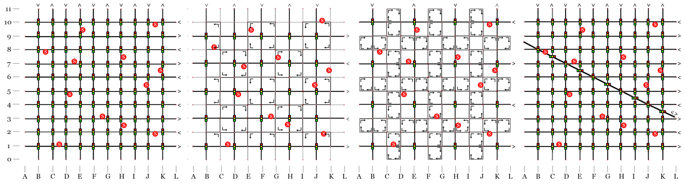

# Agent-Based Modeling and Social System Simulation 2020. *A Barcelona Paradox*

> * Group Name: **SOS** (**S**ub**O**ptimal **S**olutions)
> * Group participants names: Argota Sanchez-Vaquerizo, Javier & Schwarzenbach, Daniel 
> * Project Title: Suboptimal Traffic Efficiency in Changing Habitats (SOTECH). *A Barcelona Paradox*

* [General Introduction](#general-introduction)
* [Fundamental Questions](#fundamental-questions)
* [Research Methods](#research-methods)
* [The Model](#the-model)
* [Expected Results](#expected-results)
* [References](#references)
* [Other](#other): See for technical requirements,installation instructions and description of the repository.

## Abstract

*Following the evolution of last urban trends in re-purposing the public space for improving quality of life in cities, there is an increasing shrinkage of space for cars. Among these initiatives, Barcelona Superblocks is one of the most paradigmatic. As frequent in urban planning, the systematic analysis and evidence construction of these interventions are frequently ignored. In this experiment we proposed to analyze the traffic outcomes of the implementation of this Superblocks plan in an idealized Barcelona grid together with other potential scenarios to be as well implemented. By connecting urban interventions in city street networks with their expected outcomes we highlight the promising capabilities of the use of these methods based on modeling and simulation to question, criticise, iterate, and test city making processes in an accessible way for any stakeholder, both experts and lay people.*

## General Introduction

### Towards a systematic understanding of urban spaces

Utilitarian traffic optimization goals has dominated transport engineering since it appears as a proper discipline with the rise of private motorized vehicles. It has shaped our industrial and post-industrial cities that we inhabit. Modern Urbanism, as we understand it nowadays, sinks its roots at into a revolutionary scientific and technical approach towards the understanding of urban environment conditions and the efficient distribution of people, good, and resources around the city. Even Modernist urban planners and architects in the early 1900's endorsed a radical mechanistic understanding of cities. However, this scientific and positivist approach of traffic engineers contradicts the common practice in urban and city planning. Spatial planning, urban design, and collateral disciplines in the same realm, are affected by a combination of experimental data, domain expertise, ideology, and policy and political constraints in a non-straightforward decision making process in which opposed agendas promoted by different stakeholders are leverage to reach ideally a feasible compromise. In the best case scenario, many urban interventions are based on some domain expertise-backed intuition with the hope of eventually getting people's approval and political adoption.

The understanding of complex effects of spatial planning decisions in cities is still very limited and scarcely applied to common practice. In this context, the assessment of urban interventions in cities frequently lacks evidence support. It undermines any possibility of evaluation of results, iterative process of potential improvement, and proper informed-decision making for technical experts, decision makers, and citizens in general. The later is particularly relevant as this lack of comprehensive information on the effects of planning decisions in cities dismisses the quality of participatory processes, by masking accessible knowledge to people, and making easier to manipulate these processes.

### Barcelona's Superblocks

This knowledge and methodological gap does not hinder experimentation and innovation in the most complex human creation (citation here) as cities are. In recent years, there is a clear trend on reducing the space reserved for private motor vehicles in cities to improve air quality and environmental conditions, to foster alternative transportation modes, or to reduce the use of fossil fuels . Among these current trends on urban planning, Barcelona's Superblocks has been one of the most published in the last years. The Superblock's plan aims to reduce the space for the motor private vehicles in the street network to improve living conditions of city inhabitants by reducing noise and air-pollution and giving room to other transportation modes. It is being accomplished by creating large blocks of 3-by-3 of current square city blocks and leaving inside only loop-like residential streets. It means that 1 out of 3 streets of the city are left for driving through traffic. The well-known and a-thousands-of-times depicted idiosyncrasy of the so regular Barcelona grid comes together with a long tradition on public engagement on urban planning and experimentation in the city set an ideal scenario for testing out the unknown effect of these and other modifications in urban networks.

	
	Barcelona Superblocks schema (Rueda, 2018).

### The Braess Paradox

Among one of the most interesting and intriguing effects that defies the common understanding for operating in the urban infrastructures is the so-called Braess Paradox. It explains the counter-intuitive observation that adding more links to a given network, such as a transportation one, can slow down overall traffic flow. It is caused by the selfishly behavior of the entities that are moving in the network when trying to optimize individually their travel time (or cost). It causes to get away from the system optimum. that contrary to the real behavior, requires some level of collaboration between the agents.

## Fundamental Questions

* Are there too many streets for cars that actually are causing bigger congestion?

* If adding new roadways links leads to increased congestion, according to Braess, may removing streets for vehicles cause improvement of traffic, as expected by the Superblocks plan?

* Can we apply the counterintuitive Braess’ Paradox effects for our own benefit in the planning of cities?

## Research Methods

For modeling and simulating an urban environment to test these changes a microscopic agent-based simulation approach is followed. With this in mind, a common framework applied to transportation modeling in cities called SUMO. This software can simulate virtually any element moving around a city or region as individual agents according to different rules.

Additionally, this framework allows to run mesoscopic simulations based on a queueing: it is, instead of simulating every agent behavior independently as in an agent-based approach, every street segment is modeled as a queue of vehicles. (***citation of thesis ref***). This approach implies important performance improvements that can be used for simulating larger environments (i.e. an entire city). Consequently, for validating the results of the microsimulation a mesoscopic model is calibrated. It will be as well useful for being able to run larger scenarios more efficiently. 

## The Model

In order to build a simulation in SUMO, two basic elements are needed as initial inputs:
* A **network**, as the representation of the 'physical' environment where agents will move.
* A **demand** able to generate the movement between the different locations of the environment.

### Network

The idea behind the used environment is to generalize and abstract the main features defining the regular urban grid of the Barcelona Eixample district. Any particular area of the city of Barcelona is modeled *per se*, but just a representation of the most important features of the urban fabric. This is facilitated by the clear and straightforward ideas that back the Cerda's plan.

An section of the city made of 9x9 Barcelona's blocks is used as the base environment. It is equivalent roughly to 1.44km2. Each squared block (or if preferred, the distance between the center of the streets intersections) is 133.33 m long. All the streets have the same width and importance (i.e. there is no hierarchy in the urban fabric) and they are one-way, two-lanes, with opposing directions from one block to the following one. Additionally each intersection is regulated with traffic lights whose whole cycle last 90 seconds.

This basic network with the aforementioned parameters represents an idealization or abstraction of the current functioning of the street network in Barcelona (net 1). It is used as the basis for the modified scenarios where different changes are introduced as follows.

Two different settings for superblocks are represented: one made of 2x2 superblocks, and another one with 3x3 superblocks. Both models have been implemented already as pilot project in recent urban refurbishments in the city of Barcelona, although the latter is the original proposed design. Both settings follow the same design principles: major streets separating superblocks are the only ones suitable for cross-city traffic, and their intersections are regulated by traffic lights. Inner streets within each superblock are transformed in residential streets suitable for just residential traffic and other types of transportation. More importantly, for the model design, they are designed as one-lane and one-way loops that do not allow to cross the superblock, which makes impossible cross-city traffic. Consequently, they result into nets 2 and 3.

Finally, a fourth network is included to account for a remarkable feature of the Barcelona grid: the number of diagonal streets that cut the orthogonal grid. For this purpose, the Diagonal Avenue is taken as a reference for capturing its main features to be added to the basic grid. As a result, a diagonal broad street with two-ways and two lanes per direction is added at and angle of 30°. This is net 4.

	
	From left to right: Net 1 (basic network), net 2 (2x2 superblocks), net 3 (3x3 superblocks), and net 4 (with diagonal broad avenue).

| Net                     | Net 1         | Net 2           | Net 3           | Net 4              |
|-------------------------|---------------|-----------------|-----------------|--------------------|
| Description             | Basic network | 2x2 superblocks | 3x3 superblocks | w/ diagonal avenue |
| Length of lanes (m)     | 53920         | 36588           | 34261           | 58919              |
| Length of lanes (%)     | 100           | 68              | 64              | 109                |
| Number of intersections | 100           | 25              | 16              | 105                |

	Main metrics for each network.

### Demand

For the creation of the demand, two different kinds of mobility need to be considered:
* People whose origin and/or destination is within the represented area (i.e. people living and/or working within the network). This *endogenous* demand can be created using the activitygen routine included in SUMO from general demographic data.
* People exclusively crossing the modeled area (i.e. people who are moving around the city, whose destination is somewhere else out of the represented part of the city). This passing through traffic can be modeled from AADT available data.

In general, the regular grid of the city of Barcelona encompasses core urban districts and more residential, suburbial, and even industrial areas whose traffic demands vary largely. In this case, for the considered area, we are assuming that it belongs to a central part of the city which implied higher density of population, of economic activity, of jobs position, and in general of traffic levels (because of inner demand, and passing by population).

Very similarly to the network creation process, we generalize the transportation demand for an equivalent area of the city to the modeled 1.44km2 urban square without representing any concrete neighborhood of the city of Barcelona.

In the case of the transport demand created by *activitygen*, it needs basic demographic data which is extrapolated and generalized for the modeled network area (1.44km2) based on the Eixample district in Barcelona (7.46km2). This area matches approximately the assumption of the expected mobility intensity for a central part of Barcelona. As a result, the following population statistics are assumed for the modeled area:

- 51.120 inhabitant in the area (355 hab/ha x 144 ha)
- 2,4 persons per household
- Population < 16 yo: 14%
- Population 16 - 64 yo: 65%
- Population > 64 yo: 21%
- Schools (for the whole district): 58 (including primary, middle and high schools, private and public ones). 
- Total students 3-16 yo: 24000. Around 70% stays in the same district, and 30% move in between districts or municipalities. For the scope of this simulated area, 4800 students are considered (20%).
- Vehicles per 1000 inhabitants: 298.
- Share of private vehicle in Barcelona: 22.8%

For generalizing the driving-through traffic three neighborhoods belonging to the Eixample district are chosen as a reference for their inbound and outbound mobility patterns (i.e. people who leave or enter the area in a daily basis) (***ref Bestiario***. They are the ones showing a more more complex and demanding dynamics: La Dreta de l'Eixample, l'Antiga Esquerra de l'Eixample, and la Nova Esquerra de l'Eixample.

| Neighborhood                    | **Dreta de l'Eixample** | **L'Antiga Esquerra de l'Eixample** | **La Nova Esquerra de l'Eixample** |
|---------------------------------|-------------------------|-------------------------------------|------------------------------------|
| Total population                | 43449                   | 42189                               | 57889                              |
| Area (km2)           | 2.12                    | 1.23                                | 1.34                               |
| Density (hab/km2)    | 20500                   | 34355                               | 43200                              |
| Outbound mobility (% tot. pop.) | 30                      | 32                                  | 32                                 |
| Inbound mobility (% tot. pop.)  | 138                     | 66                                  | 32                                 |

	Demographic and mobility data for reference neighborhood.

Averaging these mobility patterns, we can assume for the model:
- Outbound mobility: 31.4% of tot. population of the model
- Inbound mobility: 74% of tot. population of the model

Finally, these total daily values can be adjusted to an hourly distribution of trips during the day for generating random trips between the fringe edges (i.e. streets situated on the limit of the network that are used for entering and exiting the model).

As a result, a total of 315000 vehicles are included into the simulation by adding the vehicles from the endogenous demand and the driving through traffic.

The initial validation of this demand modeling is performed immediately by comparing the outcomes of the hourly histogram of modeled trips to the measured total trips by the metropolitan authorities in Barcelona and the expected counting of vehicles in a similar area from the real AADT.

## Expected Results

Running this model with different demand scaling will allow to test the behavior of four proposed networks. Particularly, we expect:
- To identify that at least one of the supposedly (and so marketed) urban interventions are not as efficient regarding traffic management.
- To detect one positive effect of the Brass Paradox in traffic (it is, to identify one situation where reducing streets can improve traffic overall).
 

## References

[1] Ajuntament de Barcelona. Dades basiques de mobilitat 2015. Technical report, Ajuntament de Barcelona, Barcelona, 2016.

[2] Ajuntament de Barcelona. Superficie y densidad de los distritos y barrios. 2018. Technical report, 2018.

[3] Area de Barcelona. Autoritat del Transport Metropolitana, Ajuntament de Barcelona, Area Metropolitana de Barcelona, Associació de Municipis per la Mobilitat i el Transport Urbá, and IDESCAT. Enquesta de Mobilitat en Dia Feiner 2019 (EMEF 2019). La mobilitat a Barcelona. Technical report, Barcelona, 2020.

[4] S. A. Bagloee, A. (Avi) Ceder, M. Sarvi, and M. Asadi. Is it time to go for no-car zone policies? Braess Paradox Detection. Transportation Research Part A: Policy and Practice, 121:251{264, mar 2019.

[5] M. Bausells. Superblocks to the rescue: Barcelona's plan to give streets back to residents. The Guardian, may 2016.

[6] Bestiario Proyectos S.L. and Regidoria de Mobilitat Ajuntament de Barcelona. Commuting i dinàmiques de mobilitat als 73 barris de Barcelona: una nova cartografía utilitzant les dades de la senyal de telefonia mòbil. Technical report, 2014.

[7]  P. Blundell-Jones, D. Petrescu, and J. Till. Architecture and participation. Spon Press, 2005.

[8]  D. Braess. uber    ein    Paradoxon    aus    der    Verkehrsplanung. Unternehmensforschung, (12):258–268, 1969.

[9]  I.  Cerdà.   Teoría  general  de  la  urbanización,  y  aplicación  de  sus  principios  y doctrinas a la reforma y ensanche de Barcelona, 1867.

[10]  C. I. d. M. (CIAM).  La Chartre d’Athènes.  The Library of the Graduate School of Design, Harvard University, Paris, 1933.

[11]  Departament d’Anàlisi Oficina Municipal de Dades. Ajuntament de Barcelona. La conjuntura economica de Barcelona. Eixample. Technical report, Ajuntament de Barcelona, Barcelona, 2020.

[12]  N.  G.  Eissfeldt.   Vehicle-based modelling of traffic. Theory and application to environmental impact modelling.  PhD thesis, Universität zu Köln, 2004.

[13]  N.  Geroliminis  and  C.  F.  Daganzo.  Existence  of  urban-scale  macroscopic  fundamental diagrams:  Some experimental findings.  Transportation Research Part B: Methodological, 42(9):759–770, nov 2008.

[14]  W. Hu.  What New York Can Learn From Barcelona’s ‘Superblocks’.  The New York Times, sep 2016.

[15]  P.  A.  Lopez,   M.  Behrisch,   L.  Bieker-Walz,   J.  Erdmann,   Y.  P.  Flotterod, R.  Hilbrich,  L.  Lucken,  J.  Rummel,  P.  Wagner,  and  E.  Wiebner.  Microscopic Traffic Simulation using SUMO.  In IEEE Conference on Intelligent Transporta- tion Systems, Proceedings, ITSC, volume 2018-Novem, pages 2575–2582. IEEE, nov 2018.

[16]  S. Morel.  Avec ses ”supermanzanas”, Barcelone rend l’espace public à ses habitants.  Le Monde. Cities., dec 2019.

[17]  A.  Plaza.   José  Mansilla:   ”La  crisis  mercantilizará  más  la  ciudad:   quitamos coches  pero  no  ganamos  suelo,  se  lo  queda  el  del  bar  para  hacer  dinero”.   El Diario, 2020.

[18]  S.  Rueda.   Superblocks  for  the  design  of  new  cities  and  renovation  of  existing ones:  Barcelona’s case.  In Integrating Human Health into Urban and Transport Planning:  A Framework, pages 135–153. Springer International Publishing, jul 2018.

[19]  X. Wang, S. You, and L. Wang.  Classifying road network patterns using multinomial logit model.  Journal of Transport Geography, 58:104–112, jan 2017.

[20]  C. Wiedeman.  Politik in Barcelona:  Die Insel der Hoffnung.  Frankfurter Allge- meine Zeitung. Die Digitale Stadt., nov 2018.

[21]  L.  Zhang  and  M.  Menendez. Modeling  and  Evaluating  the  Impact  of  City Block  Size on  Traffic  Performance.   Journal of Urban Planning and Development, 146(3):04020021, sep 2020.

## Other

Note: It is needed to install SUMO software for being able to run all the scripts and experiments. Additional information is provided into the code notes. For more information regarding the installation of SUMO visit: https://www.eclipse.org/sumo/

**It is important to make sure that the environment paths are correctly assigned for the scripts to be able to run**. See details inside notebooks

* [**code**](https://github.com/Reivajar/A-BCN-Paradox/tree/master/code) contains all the necessary files for reproducing the results.
* [**doc**](https://github.com/Reivajar/A-BCN-Paradox/tree/master/doc) contains reporting files.
* [**other**](https://github.com/Reivajar/A-BCN-Paradox/tree/master/other) contains linked images to readme.
* [**presentation**](https://github.com/Reivajar/A-BCN-Paradox/tree/master/presentation) contains presentation files from 23.11.2020.
* [**videos**](https://github.com/Reivajar/A-BCN-Paradox/tree/master/videos) contains animated GIFS from the simulations.

